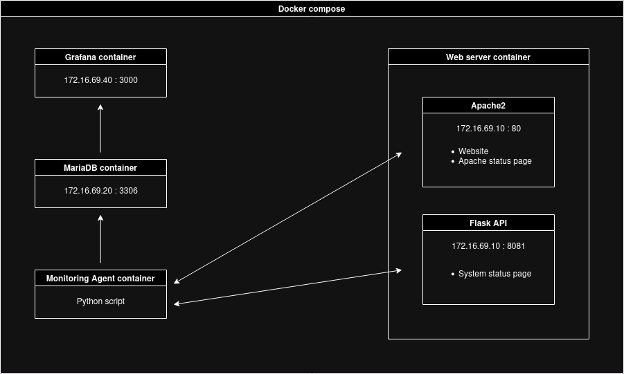

# SAE Projet collecte de logs

Le but de ce projet est de superviser un système en collectant des métriques pour ensuite les afficher sur une interface intuitive.


## Infrastructure

Nous avons choisi pour ce projet de **superviser un serveur web Apache2**.

Nous nous sommes également imposés quelques contraintes pour rendre le projet plus intéressant :
- L'infrastructure devra être entièrement configurée via des **fichiers de configuration**, pas besoin d'actions manuelles.
- L'**agent de monitoring** devra être **développé par nos soins**.

Notre projet contient 4 conteneurs Docker :
- **Serveur web :** Ce conteneur est basé sur une image Ubuntu, et contient un **serveur web** Apache2 ainsi qu'une **API Flask** exposant des données sur les ressources systèmes utilisées.

- **Agent de supervision :** L'agent de supervision est un **programme Python**. Son rôle est de **collecter des métriques** sur le serveur web, via la page de status apache2 (connections, temps de latence) ainsi que l'API Flash (CPU, mémoire, réseau, disque) pour ensuite les **insérer dans la base de donnée** SQL.

- **MariaDB :** La base de données contient deux tables, une pour les **métriques récoltés** sur Apache2 et une seconde table pour les métriques systèmes.

- **Grafana :** L'interface web Grafana nous permet de visualiser sur différents tableaux de bord les données collectées. Nous avons deux tableaux de bord, un pour les métriques Apache2, et un second pour les métriques systèmes.

**Schéma d'infrastructure :**



## Installation

Pour lancer le projet, se placer dans le dossier "docker" contenant le fichier `docker-compose.yml`, puis lancer le projet avec docker compose.

```bash
  cd docker
  docker compose up --build
```


## Utilisation

Avant de visualiser les données dans le Grafana, il est nécessaire d'effectuer quelques requêtes sur le serveur web pour faire varier les métriques remontées. L'URL du site web est : http://172.16.69.10/

L'intervalle de collecte de métrique a été réduit à 5 secondes afin de pouvoir voir assez rapidement un résultat dans les graphiques.

Ensuite, il faut se connecter à l'interface Grafana : http://172.16.69.40:3000
- Login : `admin`
- Password : `meg`

Dans le menu "Dashboards", deux dashboards sont disponibles, un remontant les métriques relatives à Apache2, et un second avec les métriques systèmes.


## Résultat

### Tableau de bord des métriques systèmes


### Tableau de bord des métriques Apache2


## Difficultés et solutions
- **Intégration de l'API au conteneur HTTPD :** L'API Flask sur le serveur web est un processus Python indépendant d'Apache2. Nous avons remarqué qu'il n'était pas possible d'utiliser l'image docker `httpd` conjointement avec notre script Python, car le point d'entrée du conteneur était le processus Apache2. Nous sommes donc passés sur une image Ubuntu où, nous installons et configurons Apache2 ainsi que nôtre API Flask via le Dockerfile du conteneur, et lançons les services avec un script.


## Auteurs

- Maxime Sahuc
- Marc Cambon