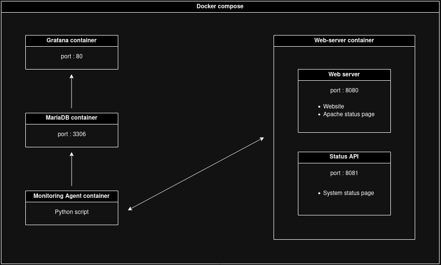

# Server monitoring

<!-- 
## Features
- configuration à base de fichiers, zero-click nécessaires
- agent de monitoring extensible
- trouver d'autres truc positif

## Lien utiles
- choix d'infrastructure
- TODO list

## TODO list
- [x] Web server container
    - [x] Apache2 status page, on port 8080 /server-status
    - [x] Status page for server ressources, on port 81
- [x] Monitoring agent container
    - [x] Script to get data from web server status pages
    - [x] Script to insert data in database
    - [x] Merge scripts in a Dockerfile
    - [x] Run the container and test
    - [x] Get data from apache2 status page and add it to database
- [x] Mariadb container
    - [x] Create databases
    - [x] Create tables
    - [x] Tests
- [x] Grafana container
    - [x] Custom config file
    - [x] Link to database
    - [x] Create Graphs
    - [x] Save config to use in docker compose
- [ ] Documentation
    - [ ] Update infrastructure diagram
    - [ ] Explain all -->

## Infrastructure diagram
<!--  -->

<!-- - [@MaximeSahuc](https://github.com/MaximeSahuc) -->

<ul display="inline">
    <li>
        

             
            <a href="https://github.com/MaximeSahuc">@MaximeSahuc</a>
        

    </li>
      
    <li>
        

             
            <a href="https://github.com/marccambon">@marccambon</a>
        

    </li>
</ul>

<!-- -  MaximeSahuc -->

<!-- 

 -->
